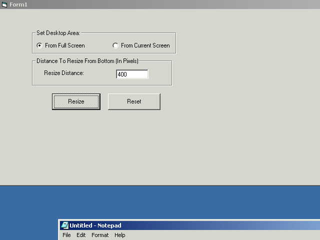



## Set Desktop Area \(Resize the desktop\)

### Description

Set/Resize the desktop area.... Great for making Shell Replacements or Dockable programs. Prevents windows from maximizing over AND Under your applications.
 
### More Info
 

             |
---                |---
**Submitted On**   |2001-05-30 12:07:24
**By**             |[Michael P Gerety](https://github.com/Planet-Source-Code/PSCIndex/blob/master/ByAuthor/michael-p-gerety.md)
**Level**          |Intermediate
**User Rating**    |4.8 (24 globes from 5 users)
**Compatibility**  |VB 6\.0
**Category**       |[Windows API Call/ Explanation](https://github.com/Planet-Source-Code/PSCIndex/blob/master/ByCategory/windows-api-call-explanation__1-39.md)
**World**          |[Visual Basic](https://github.com/Planet-Source-Code/PSCIndex/blob/master/ByWorld/visual-basic.md)
**Archive File**   |[Set Deskto202725302001\.zip](https://github.com/Planet-Source-Code/michael-p-gerety-set-desktop-area-resize-the-desktop__1-23588/archive/master.zip)

### API Declarations

in code...

